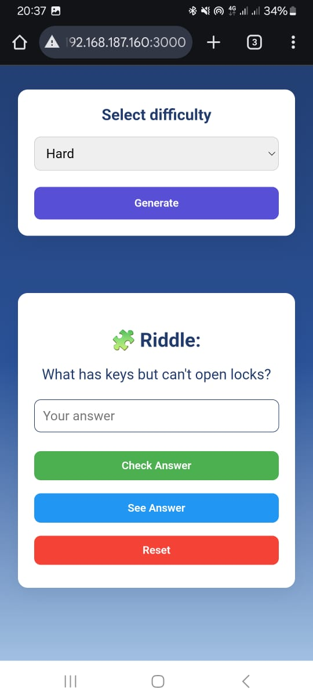

# 🧩 Enigmo Generator

**Enigmo Generator** is an AI-powered riddle generator built using **Transformers**.  
It’s trained on a large custom dataset of riddles and answers, allowing it to generate both **easy** and **hard enigmas**, with the ability to **reveal answers** upon request.  

This project combines the creativity of language models with structured NLP training to deliver challenging, fun, and brain-teasing riddles.

---

## 🚀 Features

- 🤖 **AI-Generated Riddles** — Generates original riddles using a fine-tuned Transformer model.  
- 🧠 **Multiple Difficulty Levels** — Produces both easy and hard enigmas.  
- 💬 **Answer Reveal Functionality** — Option to display the correct answer to each enigma.  
- ⚙️ **Custom Training Dataset** — Model trained on thousands of riddles and their solutions.  
- 🌐 **API or Standalone Support** — Can be integrated with Django REST or used locally.

---

## 🧱 Tech Stack

| Component | Technology |
|------------|-------------|
| **Language** | Python |
| **AI Model** | GPT-2 (Hugging Face Transformers) |
| **Training Framework** | PyTorch |
| **Backend (optional)** | Django REST Framework |
| **Database (optional)** | PostgreSQL |
| **Environment** | Virtualenv / Conda |
| **Version Control** | Git & Git LFS |

---

## 🧩 Example Outputs

| Difficulty | Example |
|-------------|----------|
| 🟢 *Easy* | “What has keys but can’t open locks?” → **Answer:** A Piano 🎹 |
| 🔴 *Hard* | “I speak without a mouth and hear without ears. What am I?” → **Answer:** An Echo 🌫️ |

---

## 📸 project Screenshots
# Desktop Screenshot:
   <p>
    
    
    
   </p>

# Mobile Screenshot:
   <p>
    
    
   </p>


### 1️⃣ Clone the repository
```bash
git clone https://github.com/thepythonistm/enigma-generator-ml.git
cd enigmo-generator
